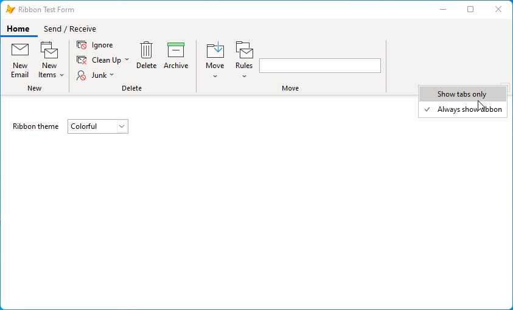
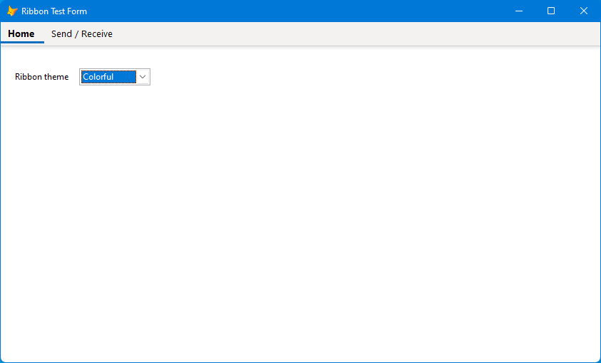

# Ribbon

This project provides a ribbon control similar to that of Microsoft Office 365 to VFP forms. The Sample.scx form included in the Samples folder of this project has a ribbon resembling that of Microsoft Outlook, with two tabs: "Home" and "Send / Receive". Here is the form with the "Home" tab selected:


Here is the form with the "Send / Receive" tab selected:


This project was created by Doug Hennig.

For guidelines about ribbon controls, see <a href="https://docs.microsoft.com/en-us/windows/win32/uxguide/cmd-ribbons" target="_blank">https://docs.microsoft.com/en-us/windows/win32/uxguide/cmd-ribbons</a>.

## Using the Ribbon

To add a ribbon to a form, drop an instance of the SFRibbon class in SFRibbon.vcx onto the form and then write code in a method of the form or perhaps the Init method of the ribbon object to add tabs, sections, and buttons to it; see the Components section below for details.

To deploy the ribbon with your application, add the following to your project:

* SFRibbon.vcx

* SFGDIMeasureString.prg

* SFRibbonDown.png

* SFRibbonRight.png

* SFRibbonCheck.png

* SFRibbonDownLarge.png

* RibbonThemes.xml

Also, include System.app with the files installed with your application.

## Components

A ribbon consists of multiple components, all of which are defined in SFRibbon.vcx:


* A tab (the SFRibbonTab class) is an item in the menu at the top, such as "Home" and "Send / Receive" in the image above. To add a tab to the ribbon, call the AddTab method, optionally passing the name of the tab (if not passed, AddTab assigns a unique name). Set the Caption property of the tab object returned by AddTab.

    ```foxpro
    loTab = Thisform.oRibbon.AddTab('Home')
    loTab.Caption = 'Home'
    ```
    
    Tabs have a Selected property which is .T. for the selected tab and .F. for all other tabs. Set this property to .T. to programmatically select a tab:
    
    ```foxpro
    Thisform.oRibbon.Home.Selected = .T.
    ```

* Each tab has a toolbar (an instance of the SFRibbonToolbar class) below it. You don't need to worry about toolbars, as they are there as a convenience only: when a tab is selected, its toolbar is made visible and the toolbars for the other tabs are hidden.

* A section (the SFRibbonToolbarSection class) is a set of buttons with a separator bar at the right and a caption at the bottom. There can be multiple sections in a toolbar. To add a section, call the AddSection method of a tab (which actually adds a section to the toolbar of a tab), optionally passing the name of the section (if not passed, AddSection assigns a unique name). Set the Caption property of the section object returned by AddSection.

    ```foxpro
    loSection = loTab.AddSection()
    loSection.Caption = 'New'
    ```

* There are two types of buttons: regular (the SFRibbonToolbarButton class) and horizontal (the SFRibbonToolbarButtonHorizontal class). The difference is that regular buttons are laid out left to right and have a 32 x 32 image with a caption below while horizontal buttons are stacked one on top of another and have a 16 x 16 image with a caption to the right. There can be multiple buttons in a section. Clicking a button either executes a command or displays a dropdown menu (discussed below).

    To add a regular button, call the AddButton method of a section, optionally passing the name of the button (if not passed, AddButton assigns a unique name).
    
    To add a horizontal button, call the AddHorizontalButton method of a section, optionally passing the name of the button (if not passed, AddHorizontalButton assigns a unique name).

    Set the Caption, Image, DisabledImage, Command, WordWrap, and EnabledExpression properties of the button object returned by AddButton or AddHorizontalButton. To use a multi-line caption, include a carriage return (CHR(13) character) in the text for the caption or set WordWrap to .T.. The code in Command is executed via the EXECSCRIPT() function, so it can consist of multiple statements separated by carriage returns if necessary. EnabledExpression optionally contains an expression (as a string) that Refresh evaluates to determine if the button is enabled.

    ```foxpro
    loButton = loSection.AddButton()
    with loButton
        .Caption = 'New' + chr(13) + 'Email'
        .Image   = 'newmail.png'
        .Command = 'Thisform.NewMail()' + chr(13) + ;
            'Thisform.Refresh()'
        .EnabledExpression = 'Thisform.IsButtonEnabled()'
    endwith
    loButton = .AddHorizontalButton()
    with loButton
        .WordWrap = .T.
        .Caption  = 'Ignore Message'
            && will be wrapped onto two lines
        .Image    = 'ignore.png'
        .Command  = 'Thisform.Ignore()'
    endwith
    ```

* A button can have a dropdown menu; if it does, a small down arrow appears in the button caption. The button has a menu if it has any bars. To add a bar to the menu, call the AddBar method of the button, passing the caption for the bar (use "\\<" in front of the character used as the hotkey for the bar just as you would with a VFP menu), the command to execute, optionally an image for the bar (16 x 16), and optionally an expression that determines when the bar is enabled (if it isn't passed, the bar is always enabled).

    To specify a dynamic image, one that's determined when the menu is displayed, use as expression surrounded with curly braces for the third parameter. See the example code for the "The ribbon can also have a dropdown menu" point below.
    
    To add a separator bar, pass no parameters to AddBar.
    
    To add a submenu to a menu bar, call the AddBar method of the bar object returned by AddBar. For example, in the code below, the "New Items" button has a menu with four bars: "E-mail Message", "Appointment", a separator, and "E-mail Message Using", the latter of which has a submenu with "More Stationery...", a separator, "Plain Text", "Rich Text", and "HTML" bars.

    ```foxpro
    loButton = .AddButton('NewItems')
    with loButton
	    .Caption = 'New' + chr(13) + 'Items'
	    .Image   = 'newitems.png'
	    .AddBar('E-\<mail Message', 'Thisform.Email()', ;
		    'newemailsmall.png')
	    .AddBar('\<Appointment', 'Thisform.Appointment()', ;
		    'appointmentsmall.png')
	    .AddBar()
	    loBar = .AddBar('E-mail Message \<Using')
	    loBar.AddBar('\<More Stationery...', 'Thisform.MoreStationery()')
	    loBar.AddBar()
	    loBar.AddBar('\<Plain Text')
	    loBar.AddBar('\<Rich Text')
	    loBar.AddBar('\<HTML')
	endwith
    ```

* The ribbon can also have a dropdown menu, displayed by right-clicking the part of the ribbon that isn't covered with buttons. To add bars to the ribbon's menu, call the AddBar method of the ribbon using the same parameters discussed above. Submenus are also supported in the same way as discussed above.

    ```foxpro
	Thisform.oRibbon.AddBar('Colorful', ;
	    "Thisform.oRibbon.Theme = 'Colorful'" + chr(13) + ;
	        "Thisform.Refresh()", ;
	    "{iif(Thisform.oRibbon.Theme = 'Colorful', 'check.bmp', '')}")
	Thisform.oRibbon.AddBar('Dark Grey', ;
	    "Thisform.oRibbon.Theme = 'Dark Grey'" + chr(13) + ;
	        "Thisform.Refresh()", ;
	    "{iif(Thisform.oRibbon.Theme = 'Colorful', '', 'check.bmp')}")
	```

* You can add other types of controls besides buttons to a section: call AddControl, passing the name (optional), class, and library for the control. Be sure to call CalculateWidth for the section so the width of the section is adjusted accordingly. For example, this code adds a textbox:

	```foxpro
	loControl = loSection.AddControl('Test', 'textbox', '')
	with loControl
	    .FontName = 'Segoe UI'
	    .Width    = 200
	    .Height   = 24
	    .Top      = int((loSection.Height - .Height)/2)
	        && center it vertically
	endwith
	.CalculateWidth()
	```

* You can reference objects hierarchically by name, starting from the ribbon. For example, Thisform.oRibbon.Home.Toolbar.New.NewEmail might reference the NewEmail button in the New section of the Home tab's toolbar in the ribbon. This is the main reason to pass a name to the various Add* methods; otherwise, you have to use the names automatically assigned to the object, so something like Thisform.oRibbon.Tab1.Toolbar.Section1.Button1.

## Behavior

A ribbon has the following behavior:

* The currently selected tab has a bar under it (a blue bar in the first screenshot above; the color is specified using the "tabbordercolor" color in the current theme; see the Themes section below) and its caption is bold.

* Hovering the mouse over a tab highlights the tab in the "tabhighlightcolor" color specified by the current theme and if it's the selected tab lengthens the bar under the tab.

* Clicking a tab makes it the selected one and displays the toolbar for that tab.

* Hovering the mouse over a button highlights the button in the "buttonhighlightcolor" color specified by the current theme.

* Clicking a button executes the command for that button. If no command was specified and there is no menu for the button (see the next point), a messagebox with "Not implemented" appears.

* A down arrow appears in the caption for a button if it has a menu. Clicking the button displays the menu. Clicking the button again, clicking outside the menu, or moving the mouse outside the form hides the menu.

* Hovering the mouse over a menu bar highlights the bar in the "menuitemhighlightcolor" color specified by the current theme.

* Clicking a bar executes the command for that bar. If no command was specified and there is no submenu for the bar (see the next point), a messagebox with "Not implemented" appears.

* A right arrow appears in the caption for a bar if it has a submenu. Submenus behave just like menus.

* The ribbon can be hidden if desired; see the "Hiding the ribbon" section.

## Hiding the ribbon

If the AllowShowTabsOnly property of the ribbon is .T., a button appears at the right edge of the ribbon with a dropdown menu showing two choices: *Show tabs only* and *Always show ribbon*.



If you choose *Show tabs only*, the ribbon hides and only tabs are displayed.



Clicking a tab temporarily displays the ribbon; clicking a button or anywhere outside the ribbon hides it again.

Choose *Always show ribbon* to display the ribbon again.

You should move the controls displayed in the form when the ribbon is hidden or reshown. To do that, bind to the ribbon's OnShowTabsOnly event. That event is passed .T. to hide the ribbon or .F. to redisplay it.

Here's an example taken from the sample form. This code is in Init:

```foxpro
bindevent(This.oRibbon, 'OnShowTabsOnly', This, 'ShowTabsOnly')
```

The ShowTabsOnly method of the form has this code:

```foxpro
lparameters tlShowTabsOnly
if tlShowTabsOnly
    This.lblTheme.Top = 69
    This.cboTheme.Top = 65
else
    This.lblTheme.Top = 169
    This.cboTheme.Top = 165
endif tlShowTabsOnly
```

Rather than hard-coding values, you could set the Top of each control relative to the ribbon's Height.

Tip: It's easier to move the controls if all of the controls are in a container; you just then set the Top property of the container.

To localize the menu choices, override the GetLocalizedString method of the ribbon control, accept a string parameter (which will be either "Show tabs only" or "Always show ribbon"), and return the desired string.

To programmatically hide or redisplay the ribbon, set the DisplayTabsOnly property to .T. (hide) or .F. (display).

## Themes

A theme defines a set of colors for the ribbon. The default is the Colorful theme:


Here is the Dark Grey theme:


Themes are defined in RibbonThemes.xml:

```xml
<themes>
	<theme name="Colorful" 
		ribbonbackcolor="243,242,241" 
		ribbonbordercolor="210,208,206" 
		ribbonshadowcolor1="234,234,234"
		ribbonshadowcolor2="238,238,238"
		ribbonshadowcolor3="243,243,243"
		ribbonshadowcolor4="247,247,247"
		ribbonshadowcolor5="251,251,251"
		menuitembackcolor="255,255,255"
		menuitemhighlightcolor="210,208,206"
		menuseparatorcolor="225,223,221"
		buttonhighlightcolor="200,198,196"
		tabhighlightcolor="250,249,248"
		tabbordercolor="16,110,190"
		sectionseparatorcolor="179,176,173"
	/>
	<theme name="Dark Grey" 
		ribbonbackcolor="190,187,184" 
		ribbonbordercolor="68,68,68" 
		ribbonshadowcolor1="75,75,75"
		ribbonshadowcolor2="82,82,82"
		ribbonshadowcolor3="88,88,88"
		ribbonshadowcolor4="95,95,95"
		ribbonshadowcolor5="102,102,102"
		menuitembackcolor="243,242,241"
		menuitemhighlightcolor="200,198,196"
		menuseparatorcolor="210,208,206"
		buttonhighlightcolor="151,149,147"
		tabhighlightcolor="200,198,196"
		tabbordercolor="32,31,30"
		sectionseparatorcolor="121,119,117"
	/>
</themes>
```

The numeric values are RGB colors.

The attributes in the XML are:

* ribbonbackcolor: The BackColor for the ribbon.

* ribbonbordercolor: The color of the border line at the bottom of the ribbon.

* ribbonshadowcolor1, ribbonshadowcolor2, ribbonshadowcolor3, ribbonshadowcolor4, and ribbonshadowcolor5: There's a "shadow" below the border line at the bottom of the ribbon. This shadow actually consists of five one-pixel high lines. These attributes specify the colors of those lines.

* menuitembackcolor: The BackColor of a bar in a menu.

* menuitemhighlightcolor: The BackColor of a bar when the mouse is mover it.

* menuseparatorcolor: The color of a separator bar in a menu.

* buttonhighlightcolor: The BackColor of a button when the mouse is over it.

* tabhighlightcolor: The BackColor of a tab when the mouse is over it.

* tabbordercolor: The color of the border line below a tab.

* sectionseparatorcolor: The color of the separator line at the right of a section.

To set the theme for the ribbon, set its Theme property to the name of the desired theme (currently just "Colorful" and "Dark Grey"). The Themes property of the ribbon contains a collection of the available theme names. The Sample.scx form included with this project uses a combobox with Thisform.oRibbon.Themes as its RowSource and Thisform.oRibbon.Theme as its ControlSource to choose the theme for the ribbon.

## Classes

All of the classes for the ribbon components are in SFRibbon.vcx.

* SFRibbonBase: the parent class for most ribbon components except as shown; a subclass of Container.

* SFRibbon: the ribbon class.

* SFRibbonTab: the tab class.

* SFRibbonToolbar: the toolbar for a tab.

* SFRibbonToolbarSection: the section class.

* SFRibbonToolbarButton: a regular button class.

* SFRibbonToolbarButtonHorizontal: a horizontal button class; a subclass of SFRibbonToolbarButton.

* SFRibbonMenu: a class used to define menus; a subclass of Custom.

* SFRibbonMenuBar: the menu bar class; a subclass of SFRibbonToolbarButtonHorizontal.

* SFRibbonMenuSeparator: the menu separator bar class.

* SFRibbonMenuForm: a form class that provides a dropdown menu; a subclass of Form.

## Updates

### 2022-04-06

* Added a Ribbon Display button to the right side of the ribbon with choices of Show Tabs Only and Always Show Ribbon and added support for hiding the ribbon. This requires adding two new images to your project: SFRibbonCheck.png and SFRibbonDownLarge.png.

* You can specify a dynamic image for a menu bar, one that's determined when the menu is displayed, by specifying an expression surrounded with curly braces for the third parameter in the AddBar call.

### 2021-07-23

* Added DisabledImage property to SFRibbonToolbarButton.

### 2021-02-11

* Changing the Visible property of a button now adjusts the toolbar so buttons and sections are always beside each other with no space in between.

### 2021-01-28

* Added a WordWrap property to SFRibbonToolbarButton; setting it to .T. forces the caption to span multiple lines if necessary.

* The width of the section's caption is now taken into account when determining the section's width.

* Added a Clear method to SFRibbonMenu so you can remove all the items from an object's menu.

* Fixed a bug: ensures the active control in a form has a Visible property before checking it (Visible may have been made protected in a subclass).

### 2021-01-06

* Added EnabledExpression to SFRibbonToolbarButton so you can define when a button is enabled without subclassing and putting code into Refresh.

* Made dropdown menus close if the user clicks the button the menu belongs to again, clicks outside the menu, or moves the mouse outside the form.

* Made changing the width of the ribbon programmatically set the width of the border and shadow lines properly.

* Made SFRibbonToolbarButton.Click work with Command containing "Thisform", such as "Thisform.SomeMethod()".

### 2020-12-29

* Made dropdown menus release the public variable loThisform when they're closed and work when the ribbon is in a top-level form.

* Changed Sample.scx to a top-level form.

### 2020-12-28

* Initial release.
